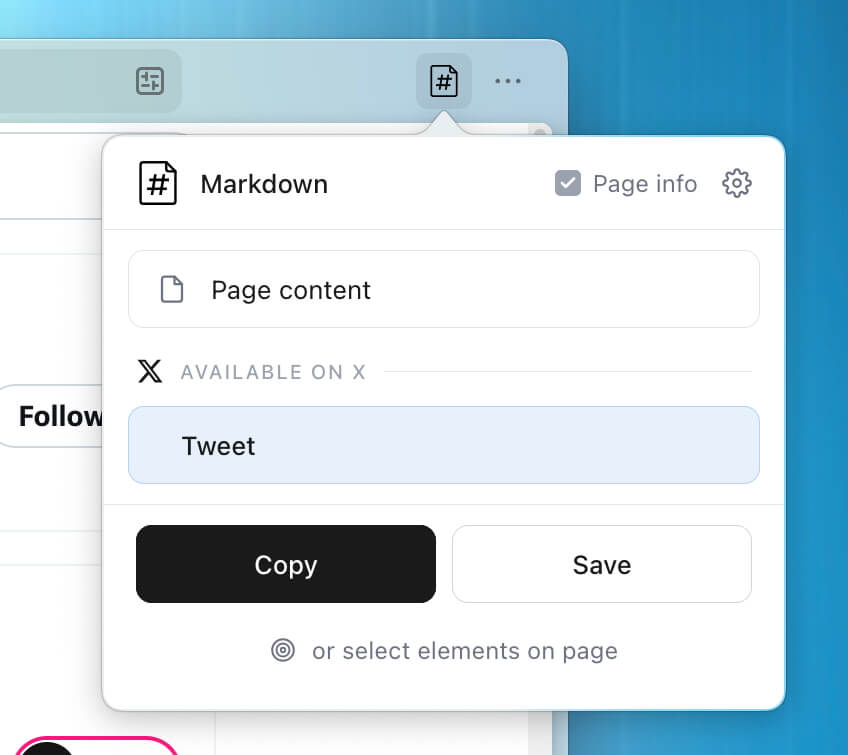
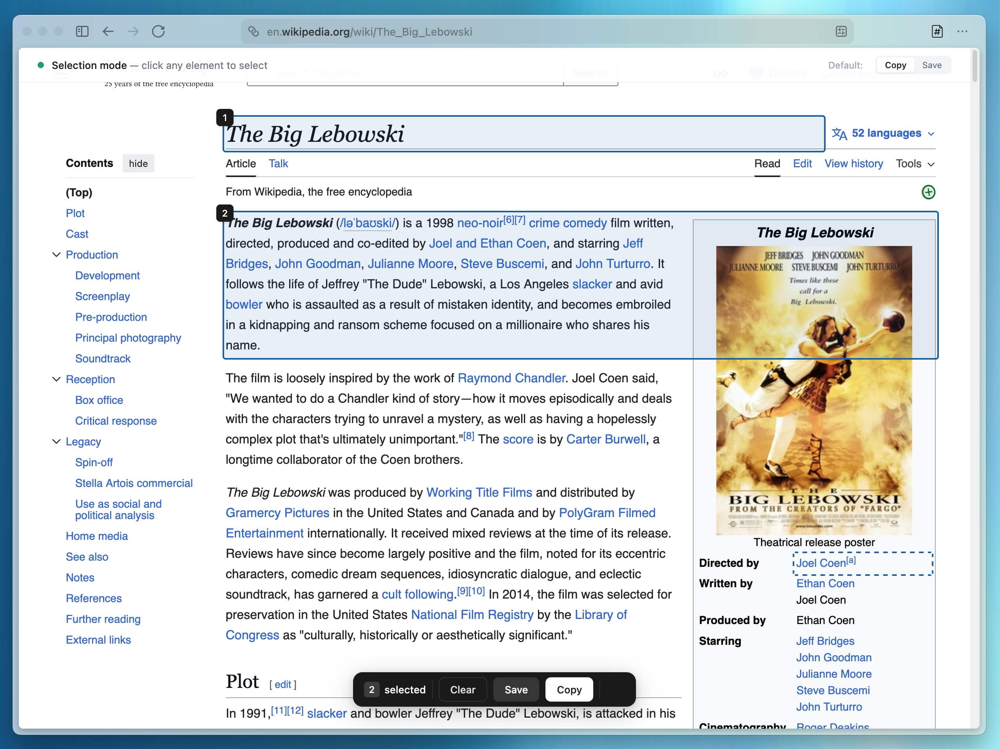
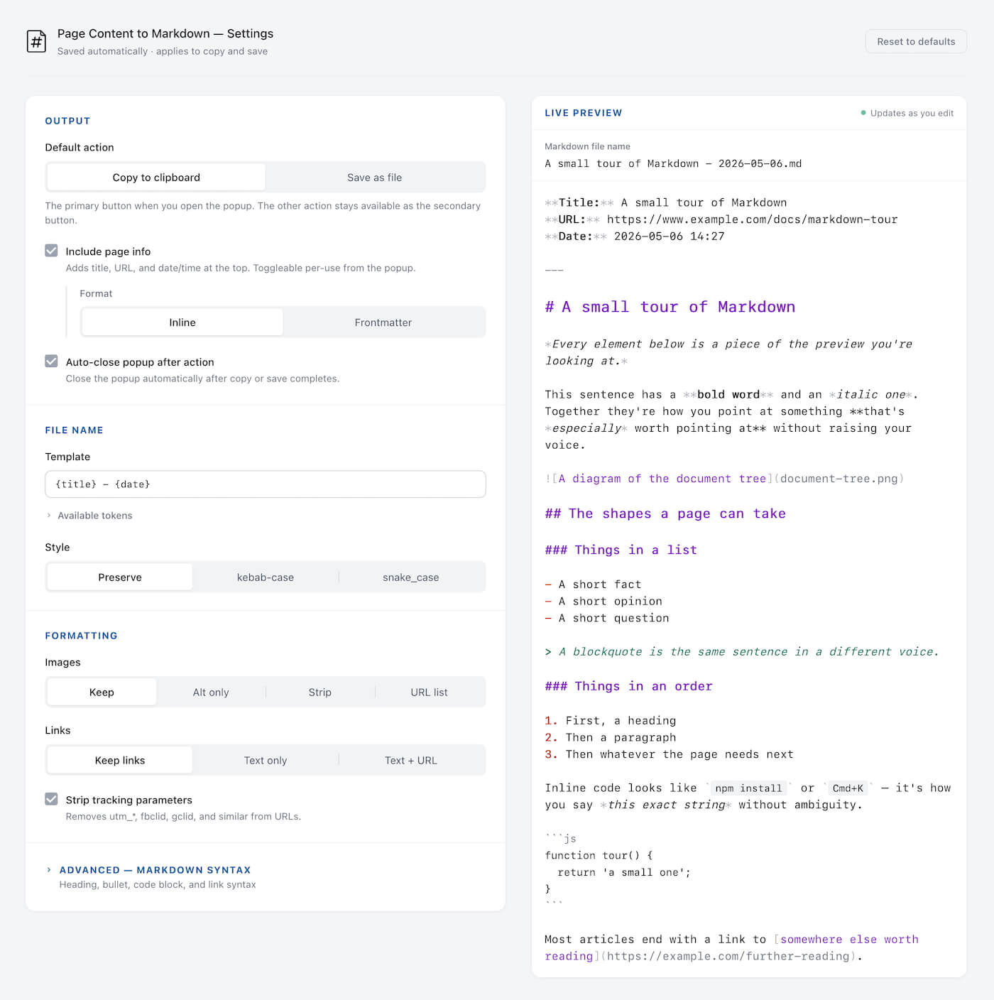

<p align="center">
  
</p>

<h1 align="center">Page Content to Markdown</h1>

<p align="center">
  A browser extension that turns the main content of any web page into clean Markdown for your notes, docs, or AI.
</p>

<p align="center">
  <a href="https://github.com/jaredatch/page-content-to-markdown/actions/workflows/test.yml"></a>
  <a href="LICENSE"></a>
</p>

<p align="center">
  <a href="#install">Install</a> •
  <a href="#getting-started">Getting Started</a> •
  <a href="#features">Features</a> •
  <a href="#supported-sites">Supported sites</a> •
  <a href="#examples">Examples</a> •
  <a href="docs/content-extraction.md">How it works</a>
</p>

---

Markdown may be 22 years old, but the explosion of AI, agents, Obsidian, and other tools has made it more important than ever.

Page Content to Markdown aims to make this fast _and_ easy.

Click the extension icon, pick what you want to capture, and you get clean optimized Markdown back. That's it.

By default it skips nav, ads, footers, comments, and the rest of a page's chrome so what you save is the actual content.

For X, Claude, Grok, and ChatGPT, dedicated extractors do better than the general path. They handle threading, reasoning blocks, code panels, citations, and conversation roles correctly so what you save reads like what you'd actually want, not a screen-scrape.

Everything happens in your browser. No servers, no telemetry, no third parties, no bullshit.

<p align="center">
  
</p>

## Install

- **Firefox:** [install from Firefox Add-ons](https://addons.mozilla.org/en-US/firefox/addon/page-content-to-markdown/).
- **Chrome / Edge / Brave / Arc:** Chrome Web Store listing pending review. For now, build from source — instructions below.

### Build from source

```bash
git clone https://github.com/jaredatch/page-content-to-markdown.git
cd page-content-to-markdown
npm install
npm run build
```

Then load the built `dist/` directory:

- **Firefox:** `about:debugging` → "This Firefox" → "Load Temporary Add-on" → select `dist/manifest.json`
- **Chrome:** `chrome://extensions` → enable Developer Mode → "Load unpacked" → select `dist/`

## Getting Started

Open the popup, then pick what you want to capture: Page content for the main content, or, on supported sites, a Tweet, Thread, Conversation. Hit **Copy** or **Save**. The popup remembers your last pick per site.

- **Pick specific elements:** use the "select elements on page" link → hover and click → Copy or Save from the floating action bar (the selection persists, so you can fire both on the same set)
- **Selected text:** right-click → "Copy selection as Markdown"
- **Default action:** Copy or Save — whichever you set as default in the extension options page becomes the filled primary button
- **Settings:** click the gear icon in the popup header to configure output, formatting, the page-info format, and more

<p align="center">
  
  <br>
  <em>Selector mode, grab just what you want.</em>
</p>

## Features

- **Smart content extraction.** Skips nav, ads, newsletter sign up forms, footers, comments, and other page chrome by default. Read more on [how it works](docs/content-extraction.md)
- **Intuitive content selector.** Jump into selection mode, click the page elements or content you want, and you're done.
- **Fine-tuned site actions for X, Claude, Grok, and ChatGPT.** Dedicated extractors that handle each site's quirks directly. E.g. on X, we detect what's actually on the page and only show the options that fit — single tweet, thread, or article. Check out [supported sites](docs/supported-sites.md).
- **Modern Markdown.** Full GFM — tables, strikethrough, task lists, etc.
- **Clipboard or file.** Copy to clipboard or save as `.md`. You decide.
- **Page info as inline metadata or YAML frontmatter.** Title, URL, and date/time at the top of every save — as bold key-value lines, or as YAML for Obsidian, Logseq, Hugo, Jekyll, and similar tools.
- **Image and link handling.** Keep them, replace with alt text, strip them, or collect image URLs at the end of the doc. Useful when feeding output to LLMs that don't need the noise.
- **Removes tracking parameters.** `utm_*`, `fbclid`, `gclid`, and other analytics noise removed from URLs by default.
- **Customizable filenames.** Template-based with tokens (`{title}`, `{date}`, `{domain}`, `{slug}`, etc.) and a choice of preserve / kebab-case / snake_case.
- **Formatting preferences.** Heading style, bullet markers, code blocks, link style.
- **Keyboard shortcuts and context menus.** `Cmd+Shift+M` / `Ctrl+Shift+M` toggles selection mode. A second shortcut (no default — bind it yourself in your browser's extension shortcut settings) runs your default Copy/Save action with the smart-detected content type, no popup needed. Right-click to convert selected text or pick an element.

## Supported sites

For these sites, dedicated extractors produce cleaner output than the general path:

| Site | Content types | Where it works |
|---|---|---|
| **X / Twitter** | Tweet, Thread, Article | `x.com`, `twitter.com` |
| **Claude** | Conversation | Share pages and active chats |
| **Grok** | Conversation | Share pages and active chats |
| **ChatGPT** | Conversation | Share pages and active chats |

See [docs/supported-sites.md](docs/supported-sites.md) for the full breakdown of what each site action captures, and [docs/building-site-extractors.md](docs/building-site-extractors.md) if you want to add another.

## Examples

Saving a single tweet with the **default inline page info**:

````markdown
**Title:** X Post by @naval  
**URL:** https://x.com/naval/status/2011358865187848389  
**Date:** May 6, 2026 at 3:34 PM

---

## @naval (Naval ✓)
*Posted: January 14, 2026 at 2:44 AM*

If you aren't getting happier as you get older, you're doing it wrong.

💬 988  🔁 4.4K  ❤️ 36.5K  🔖 4.3K  👁 1.2M
````

Saving a Claude active chat with **YAML frontmatter** instead — the format Obsidian, Logseq, Hugo, and Jekyll all parse:

````markdown
---
title: "Why is array === array always false in JavaScript?"
url: https://claude.ai/chat/abc123
date: 2026-05-06 14:32
---

# Why is array === array always false in JavaScript?

---

**Human:**

I have two arrays with identical contents and `a === b` returns false. What's going on?

---

**Claude:**

This is one of the most common JavaScript gotchas. Arrays are **reference types** — when you compare them with `===`, you're comparing whether both variables point to the *same array in memory*, not whether their contents match.

```js
const a = [1, 2, 3];
const b = [1, 2, 3];
const c = a;

a === b  // false — different arrays, same contents
a === c  // true  — same array (c just references a)
```

To compare contents, use `JSON.stringify(a) === JSON.stringify(b)` for simple cases, or Lodash's `isEqual` for anything more complex.

---
````

<p align="center">
  
  <br>
  <em>ALL THE OPTIONS! Granular control of your generated markdown.</em>
</p>

## Privacy

Everything stays on your machine. The extension makes no network calls and contacts no third-party services. Your preferences live in browser storage.

See the [Privacy Policy](docs/privacy-policy.md) for the full breakdown of permissions and what they're used for.

## Documentation

- [How content extraction works](docs/content-extraction.md) — capture/strip strategy and FAQ
- [Supported sites](docs/supported-sites.md) — what each site action captures
- [Building site extractors](docs/building-site-extractors.md) — workflow for adding new sites
- [Contributing](CONTRIBUTING.md) — setup, tests, and PR guide

## Browser compatibility

- **Firefox** (primary target): MV3 with `background.scripts` (also works great with [Zen Browser](https://zen-browser.app/))
- **Chrome**: MV3 with `service_worker`
- **Keyboard shortcuts:** `Cmd+Shift+M` / `Ctrl+Shift+M` toggles selection mode (avoids Firefox's `Cmd+Shift+S` screenshot conflict). Quick-extract has no default key; bind your own.

## Acknowledgements

Originally forked from [elad12390/browser-extension-copy-page-as-markdown](https://github.com/elad12390/browser-extension-copy-page-as-markdown). The project has been substantially rewritten since; the fallback text extractor (`simple-universal-extractor.js`) is the main piece of the original that remains. Thanks to Elad for the initial scaffold.

## License

MIT because of course. see [LICENSE](LICENSE) for full text. Brand icons in the site-action display are from Font Awesome and Lobe Icons; see [ATTRIBUTIONS.md](ATTRIBUTIONS.md) for credits.
